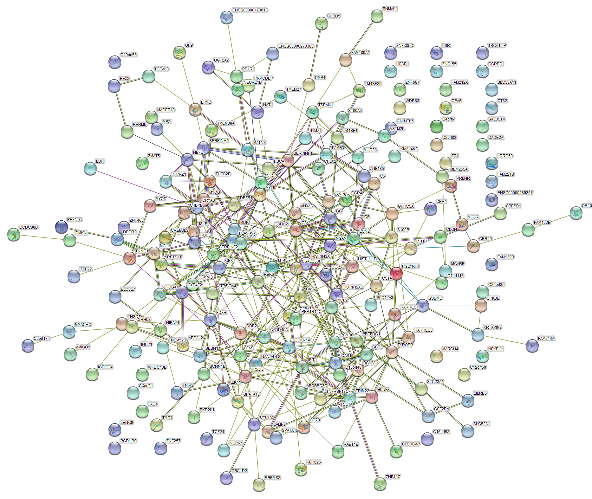
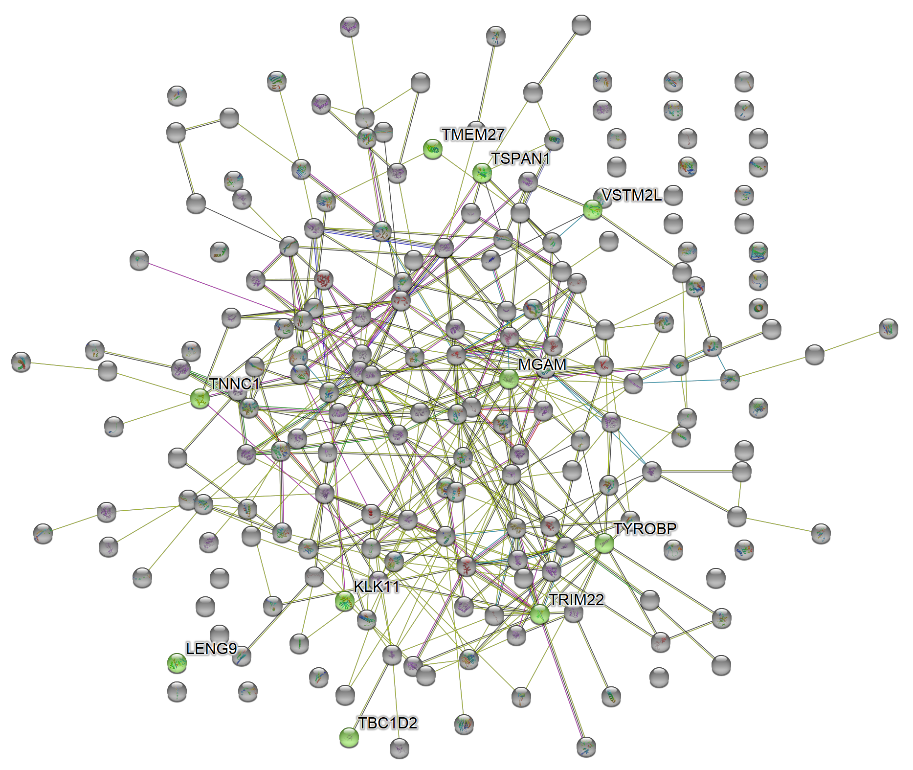
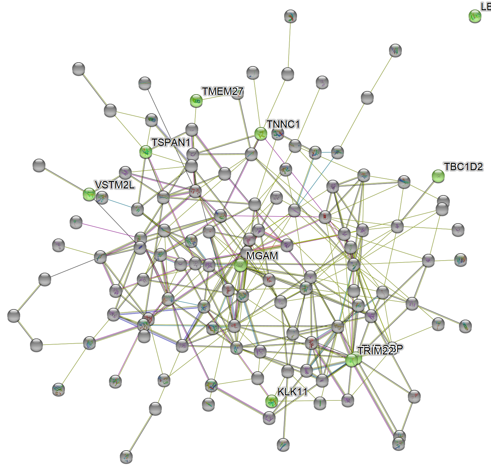

<!-- README.md is generated from README.Rmd. Please edit that file -->

# STRINGutils

<!-- badges: start -->
<!-- badges: end -->

STRINGutils provides additional utilities for
[STRINGdb](https://www.bioconductor.org/packages/release/bioc/html/STRINGdb.html)
such as getting SVG file of STRING network and highlighting features of
interest.

## Installation

You can install STRINGutils with:

``` r
devtools::install_github("chiasinL/STRINGutils")
#> Downloading GitHub repo chiasinL/STRINGutils@HEAD
#> stringi (1.5.3 -> 1.6.1) [CRAN]
#> Skipping 1 packages not available: STRINGdb
#> Installing 1 packages: stringi
#> Installing package into 'C:/Users/s-cliew2/AppData/Local/Temp/RtmpQ9rQrH/temp_libpath87d417364979'
#> (as 'lib' is unspecified)
#> 
#>   There is a binary version available but the source version is later:
#>         binary source needs_compilation
#> stringi  1.5.3  1.6.1              TRUE
#> installing the source package 'stringi'
#>          checking for file 'C:\Users\s-cliew2\AppData\Local\Temp\RtmpOk0vql\remotesa2dc39194816\chiasinL-STRINGutils-a7da7e7/DESCRIPTION' ...     checking for file 'C:\Users\s-cliew2\AppData\Local\Temp\RtmpOk0vql\remotesa2dc39194816\chiasinL-STRINGutils-a7da7e7/DESCRIPTION' ...   v  checking for file 'C:\Users\s-cliew2\AppData\Local\Temp\RtmpOk0vql\remotesa2dc39194816\chiasinL-STRINGutils-a7da7e7/DESCRIPTION' (548ms)
#>       -  preparing 'STRINGutils':
#>    checking DESCRIPTION meta-information ...     checking DESCRIPTION meta-information ...   v  checking DESCRIPTION meta-information
#>       -  checking for LF line-endings in source and make files and shell scripts
#>       -  checking for empty or unneeded directories
#>       -  building 'STRINGutils_0.0.0.9000.tar.gz'
#>      
#> 
#> Installing package into 'C:/Users/s-cliew2/AppData/Local/Temp/RtmpQ9rQrH/temp_libpath87d417364979'
#> (as 'lib' is unspecified)
```

## Quick demo

For more thorough walkthrough of the package, please see the
[vignette](./vignettes/STRINGutils_Vignette.Rmd).

Getting SVG file of STRING network:

    #> Loading required package: STRINGdb
    #> Warning: package 'STRINGdb' was built under R version 4.0.4

``` r
library(STRINGutils)
get_svg(string_db, hits, file = "my_network.svg")
#> {xml_document}
#> <svg class="notselectable" height="1574" id="svg_network_image" style="vertical-align:top;" width="1867" xmlns="http://www.w3.org/2000/svg" xmlns:svg="http://www.w3.org/2000/svg" xmlns:xlink="http://www.w3.org/1999/xlink">
#> [1] <style type="text/css"><![CDATA[\n                               .nwbubbl ...
#> [2] <g id="background"/>
#> [3] <g id="svg_string_logo"/>
#> [4] <g id="edges">\n  <g class="" id="edge.4447812.4447168">\n    <line class ...
#> [5] <g id="nodes">\n  <defs>\n    <filter id="filter_shadow">\n      <feGauss ...
```

``` r
magick::image_read_svg("my_network.svg")
```

<div class="figure">


<p class="caption">
Full network
</p>

</div>

If we have a list of proteins of interest, the **full** or **sub-**
STRING network of the proteins can be obtained. These proteins will be
highlighted by the colors of choice.

For full network:

``` r
plot_features(example1_mapped, colors_vec, string_db, entire = TRUE)
#> Getting 200 nodes from STRING network...
#> Table of features of interest is printed to: "table_features_of_int.csv"
#> NULL
```

``` r
magick::image_read_svg("features_of_int.svg")
```

<div class="figure">


<p class="caption">
Full network
</p>

</div>

For subnetwork:

``` r
plot_features(example1_mapped, colors_vec, string_db)
#> Getting 200 nodes from STRING network...
#> Table of features of interest is printed to: "table_features_of_int.csv"
#> --------------------------
#> Cluster 2 is a hit
#> 9606.ENSP00000232975 | 9606.ENSP00000361072 | 9606.ENSP00000369699
#> Cluster 3 is a hit
#> 9606.ENSP00000362560
#> Cluster 4 is a hit
#> 9606.ENSP00000447378
#> Cluster 5 is a hit
#> 9606.ENSP00000262629 | 9606.ENSP00000369299 | 9606.ENSP00000481721
#> Cluster 7 is a hit
#> 9606.ENSP00000473047
#> Cluster 40 is a hit
#> 9606.ENSP00000479355
#> --------------------------
#> Cluster information for features of interest is printed to: "cluster_info_features_of_int.csv" since entire = FALSE
#> NULL
```

``` r
magick::image_read_svg("features_of_int.svg")
```

<div class="figure">


<p class="caption">
Subnetwork
</p>

</div>
